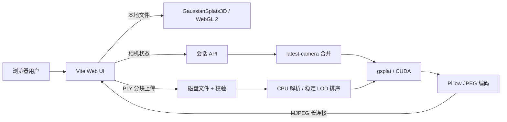

# 技术架构

## 两条渲染路径

浏览器本地模式支持 `.ply`、`.splat`、`.ksplat` 和 `.spz`，文件不离开用户设备。服务端模式目前接收标准 binary little-endian 3DGS PLY；服务进程解析并验证参数，把模型常驻一张指定 GPU，由 gsplat 完成光栅化。

## 服务端帧流

客户端创建 `/api/session` 后，用一个 `multipart/x-mixed-replace` 长连接接收 JPEG。相机更新只写入该会话的最新状态，不为每个鼠标事件排一个完整渲染任务。流线程取走状态时记录 revision；渲染期间到达的多个更新会被合并为下一次最新状态。

会话空闲时不主动渲染，仅每 15 秒重发上一帧维持连接。默认最多 4 个会话、120 秒无流连接自动回收。GPU 光栅化通过进程内锁串行化，JPEG 编码位于锁外，因此其他请求可在 CPU 编码期间使用 GPU。

## 当前 LOD

模型加载时使用 `opacity × max(scale)²` 作为与视角无关的重要性近似，只排序一次。三个 LOD 是同一数组的稳定前缀：

- `preview`：25%，交互时配合 640×360、JPEG quality 72。
- `balanced`：55%，性能模式静止帧使用 800×450。
- `full`：100%，高清模式静止帧使用 1280×720。

稳定前缀避免 LOD 切换时随机闪烁，也避免每帧生成 GPU 索引数组。它能减少光栅工作集和传输带宽，但不会减少完整模型的常驻显存，这是它与空间流式 LOD 的关键区别。

## 负载控制

- `CUDA_VISIBLE_DEVICES` 固定物理 GPU，避免误用其他卡。
- `torch.cuda.set_per_process_memory_fraction` 设置进程上限。
- 加载和渲染前检查剩余显存；捕获 CUDA OOM 并清理缓存。
- PLY 校验长度、字段、有限值和尺度语义，阻止异常 Gaussian 放大 tile buffer。
- 会话数有硬上限，所有相机 JSON 和上传文件均有限制。
- 上传以 4 MiB 块写盘，不在 HTTP 层复制整个文件。
- 浏览器本地渲染依赖动态导入，服务端模式首屏只下载 UI 主包。

## 部署边界

当前 HTTP 服务采用 Python 标准库，适合隔离容器内验证。公网部署应在它前面增加 TLS 反向代理、认证、上传限速、请求体限制和审计；当前 `Access-Control-Allow-Origin: *` 与无鉴权配置仅适用于受控测试网络。

每个 GPU 建议运行一个渲染 worker，由独立调度层做会话亲和性和 admission control。不要简单增加同卡 worker 数量：每个 CUDA 进程都有上下文开销，且并发光栅化可能造成尾延迟和 OOM。

## API 摘要

| 方法 | 路径 | 用途 |
| --- | --- | --- |
| GET | `/health`, `/api/status` | GPU、模型、能力与会话状态 |
| POST | `/api/model` | 原始请求体上传标准 PLY |
| POST | `/api/render` | 单次 JPEG 渲染，兼容与高清截图 |
| POST | `/api/session` | 创建交互会话并提交初始相机 |
| POST | `/api/session/{id}/camera` | 更新最新相机、分辨率和 LOD |
| GET | `/api/session/{id}/stream` | MJPEG 帧流 |
| GET | `/api/session/{id}` | 最近一帧指标 |
| DELETE | `/api/session/{id}` | 主动释放会话 |
