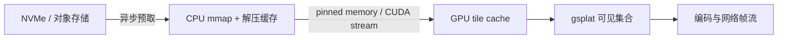

# 大规模 3DGS 渲染路线

## 已经解决的问题

当前版本已经解决“每次拖动都建立完整图片请求并让旧帧排队”的交互卡顿：浏览器使用长连接接收帧，相机状态合并，移动期间降低分辨率和 LOD，停止 140 ms 后自动细化。它也降低了单帧临时显存、JPEG 大小和首屏 JavaScript 下载量。

## 尚未解决的硬边界

完整模型仍被解析到 CPU 后一次性复制进 GPU。仅按重要性截取前缀虽然可以少渲染一些点，却不能加载一个大于 GPU 常驻预算的完整世界模型。千万至亿级场景必须改为 out-of-core 空间流式方案，不能只提高 `MEMORY_FRACTION`。

## 推荐的空间流式格式

离线预处理器应把标准 PLY 转成项目专用目录或单文件容器：

```text
scene.gsmeta                 # 版本、坐标系、全局包围盒、SH 阶数
nodes.bin                    # 扁平化八叉树 / Morton 节点表
chunks/xx/xxxxxxxx.gsbin     # 内容寻址、量化并压缩的 Gaussian 块
```

每个树节点保存包围盒、几何误差、Gaussian 数、压缩字节数、子节点范围和一个可独立渲染的代理 LOD。叶块建议控制在 2–8 MiB，使磁盘读取、网络传输和 GPU 上传都可取消并有明确预算。位置可按节点包围盒量化，rotation/scale/opacity/color 按可接受误差量化；SH 高频系数可随 LOD 延迟加载。

## 每帧选择算法

1. 从根节点开始做视锥裁剪。
2. 估算节点在屏幕上的投影误差；小于阈值时渲染当前代理，否则遍历子节点。
3. 按 `屏幕误差收益 / 预计字节` 排序，在 Gaussian 数、显存和帧时间三重预算内选择节点。
4. 对进入/离开的节点设置滞回区间，并让父子 LOD 短暂交叉淡化，避免视角轻微变化导致闪烁。
5. 复用上一帧集合，只增量上传变化的 tile。

不要只按相机距离选 LOD：狭长场景、超大尺度 Gaussian 和不同 FOV 下都会失真。屏幕空间误差和实际投影半径更稳定。

## 三级缓存



- 磁盘层使用内容哈希与顺序布局，支持 Range 请求和断点恢复。
- CPU 层使用 mmap、固定总字节 LRU，并给当前视锥与预测视锥更高优先级。
- GPU 层按字节预算缓存 tile，使用引用计数避免驱逐正在渲染的块；上传走独立 CUDA stream。
- 当新 tile 未到达时继续使用父级代理，不能让画面出现空洞。

## 网络传输选择

MJPEG 的优点是实现简单、浏览器兼容和单帧独立，当前阶段很适合调试；缺点是带宽较高且 CPU JPEG 编码会随用户数线性增加。公网多用户建议增加 WebRTC：相机控制走 DataChannel，视频走低延迟编码，利用拥塞控制动态调整码率和分辨率。是否使用硬件编码必须先检测实际宿主机和驱动能力，不能假设所有 V100 环境都提供可用编码器。

模型 tile 流和服务端视频流是两种不同模式：服务端渲染用户只需要视频；未来高性能桌面用户可以直接接收可见 tile 并在浏览器渲染。二者可共用同一份空间索引和缓存服务。

## 建议实施顺序

1. 采集真实大场景数据：Gaussian 数、空间分布、最大投影半径、目标分辨率和并发用户数。
2. 实现 `build_scene_index.py`：八叉树、代理 LOD、量化 chunk 和 manifest 校验。
3. 实现单会话 CPU mmap + GPU tile cache，先保持现有 MJPEG 协议。
4. 加入帧时间控制器，让 LOD 阈值根据最近 P50/P95 GPU 时间自动收敛。
5. 再做多 GPU 调度、WebRTC 和公网安全层；这时才进行并发容量测试。

下一阶段最需要共同确认的三个输入是：目标最大 Gaussian 数、典型场景的空间尺度/是否城市级、以及同时在线用户数。它们直接决定八叉树深度、tile 大小、GPU 缓存预算和传输协议。
